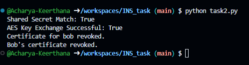

# Secure Key Exchange and Certificate Authority Demo

This repository provides a demonstration of a basic key management system incorporating a Key Distribution Center (KDC), a Certificate Authority (CA), Diffie-Hellman key exchange, and AES key encryption using RSA encryption. The code is designed for educational and demonstration purposes.

## Overview

The project simulates the following security components:
- **Key Distribution Center (KDC):** Manages symmetric AES keys for users.
- **Certificate Authority (CA):** Issues and revokes certificates for users, verifying their authenticity.
- **Diffie-Hellman Key Exchange:** Allows two parties (Alice and Bob) to derive a shared secret over an insecure channel.
- **RSA Encryption:** Encrypts and decrypts symmetric keys using RSA with OAEP padding.

## Features
- **Symmetric Key Management:** Generates and retrieves AES keys.
- **Certificate Management:** Issues, verifies, and revokes user certificates.
- **Secure Key Exchange:** Uses Diffie-Hellman for deriving a shared secret.
- **RSA Encryption for Secure Key Transfer:** Encrypts symmetric keys for secure transmission.

## Requirements
- **Python 3.6+**
- **cryptography** module

### Installing Dependencies
Install the required dependency using pip:
```bash
pip install cryptography
```

## Running the Code

1. **Clone or Download** this repository to your local machine.
2. **Navigate** to the project directory in your terminal.
3. **Run the script**:
   ```bash
   python your_script_name.py
   ```
   Replace `your_script_name.py` with the name of the Python file containing the code.

## Online Compiler
You can run and experiment with the code using an online Python compiler. For instance, try it on [GDB](https://onlinegdb.com/R-eLztiiZ).

## Code Structure

- **KDC Class:**  
  - Manages symmetric key generation and storage.
- **CA Class:**  
  - Issues certificates based on a user's public key.
  - Revokes certificates and verifies their validity.
- **Diffie-Hellman Functions:**  
  - Generate DH parameters and key pairs.
  - Derive a shared secret between two parties.
- **RSA Encryption Functions:**  
  - Encrypt and decrypt symmetric AES keys using RSA with OAEP padding.
- **Main Demonstration:**  
  - Simulates the process of key generation, certificate issuance, Diffie-Hellman key exchange, and certificate revocation.
## Expected Output

When the script is executed, the expected output will look similar to this:

This confirms that the Diffie-Hellman key exchange was successful, the AES key was securely exchanged, and the certificate authority revoked Bob's certificate correctly.
## Security Note
This demo code is intended for educational purposes only. It should not be used as-is in production environments. In production, use thoroughly tested cryptographic libraries and follow industry best practices.

## License
This project is open-source and available under the MIT License.

